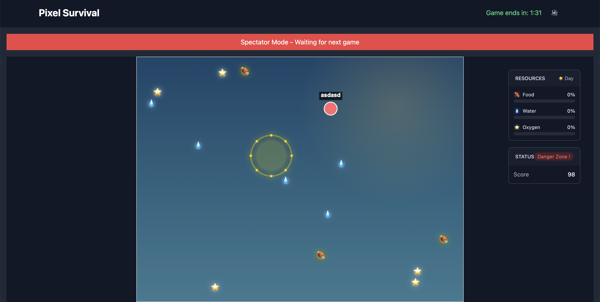
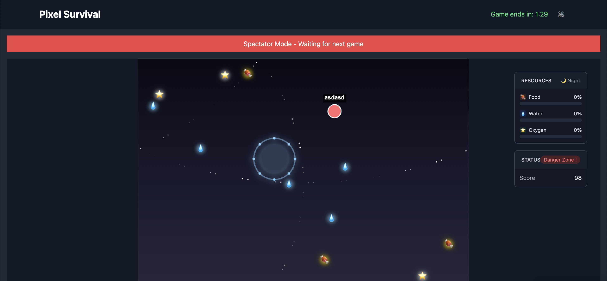

# 🌲 Pixel Survival: Forest Escape

A thrilling multiplayer pixel-art survival game where players compete to stay alive in a mysterious forest for 5 minutes. Manage your resources, survive the night, and become the ultimate survivor!

## 🎮 Features

- **Real-time Multiplayer**: Compete or cooperate with players worldwide
- **Resource Management**: Collect food, water, and oxygen to survive
- **Day/Night Cycle**: Dynamic gameplay with challenging nighttime mechanics
- **Safe Zones**: Find shelter during dangerous nights
- **Pixel Art Graphics**: Beautiful retro-style visuals
- **Cross-Platform**: Play on any modern browser

## 🛠️ Tech Stack

### Frontend
- React 18 with TypeScript
- HTML5 Canvas for game rendering
- TailwindCSS for UI styling
- WebSocket for real-time communication

### Backend
- Node.js with Express
- WebSocket server for real-time game state
- TypeScript for type safety

## 🚀 Getting Started

### Prerequisites
- Node.js 16+
- npm or yarn
- Git

### Installation

1. Clone the repository:
```bash
git clone https://github.com/yourusername/pixel-survival-game.git
cd pixel-survival-game
```

2. Install dependencies for both client and server:
```bash
# Install client dependencies
cd pixel-survival-client
npm install

# Install server dependencies
cd ../server
npm install
```

3. Start the development servers:
```bash
# Start the server (from server directory)
npm run dev

# Start the client (from pixel-survival-client directory)
npm run dev
```

4. Open http://localhost:5173 in your browser

## 🎯 How to Play

1. Use WASD or Arrow keys to move your character
2. Collect resources (food, water, oxygen) during daytime
3. Find safe zones before night falls
4. Survive for 5 minutes to win!

## 🎨 Game Screenshots


*Daytime gameplay - collect resources and explore*


*Nighttime gameplay - find shelter and survive*

## 🤝 Contributing

We welcome contributions! Please follow these steps:

1. Fork the repository
2. Create a feature branch (`git checkout -b feature/amazing-feature`)
3. Commit your changes (`git commit -m 'Add amazing feature'`)
4. Push to the branch (`git push origin feature/amazing-feature`)
5. Open a Pull Request

## 📝 License

This project is licensed under the MIT License - see the [LICENSE](LICENSE) file for details.

## 🎉 Fun Facts

- The game was inspired by classic survival games and pixel art aesthetics
- Each resource has a unique collection sound
- Night cycles are truly terrifying with dynamic lighting effects
- Players can find easter eggs hidden throughout the forest
- The safe zones are procedurally generated each game

## 🐛 Known Issues

- Mobile controls need optimization
- Some browsers might experience WebSocket connection issues
- Resource spawning can sometimes be uneven

## 📞 Contact

For questions or feedback, please open an issue or contact us at:
- Discord: [Join our server](discord-link)
- Twitter: [@PixelSurvivalGame](twitter-link)

---

Made with ❤️ by the Pixel Survival Team 